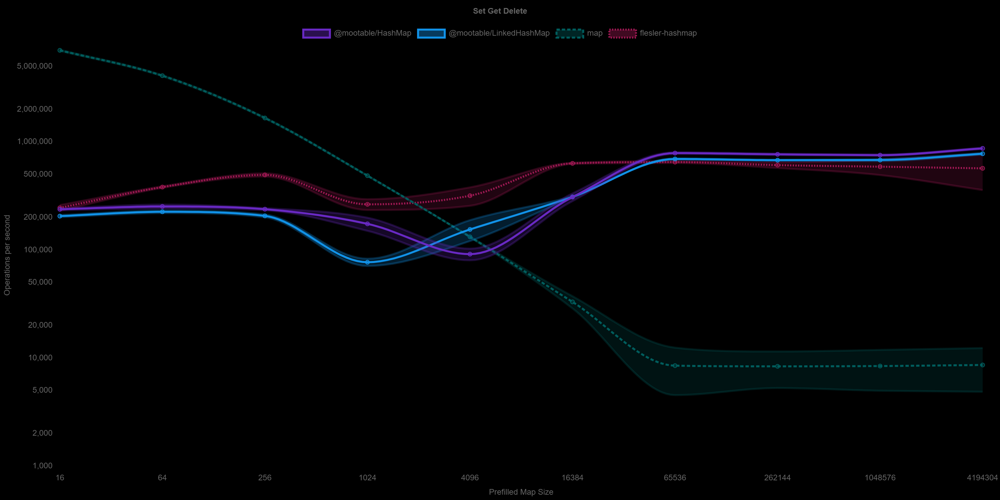

[](https://mootable.github.io/hashmap/) [](https://coveralls.io/github/mootable/hashmap?branch=master) [](https://snyk.io/test/github/mootable/hashmap)
[](http://inch-ci.org/github/mootable/hashmap) [](http://inch-ci.org/github/mootable/hashmap)

# HashMap & LinkedHashMap


## Description

This project provides `HashMap` and `LinkedHashMap` classes that works both on **Node.js** and the **browser**.

*   They are both implementations of a simplified [HAMT](https://en.wikipedia.org/wiki/Hash_array_mapped_trie) like [hash trie](https://en.wikipedia.org/wiki/Hash_tree_\(persistent_data_structure\))
*   It uses a modified [Murmer 3](https://en.wikipedia.org/wiki/MurmurHash) algorithm for generating hashes. This ensures the widest possible spread across all buckets.
*   As per spec, the basic `Hashmap` is not guaranteed to meet order of insertion when iterating over it. If you want guaranteed insertion order when iterating, use `LinkedHashMap`.
*   The keys are truly typed and unique, this means 1 !== "1".

### Choose your map wisely.

*   When choosing a collection it is worth understanding the problem you are trying to solve.
*   [Native JS Map](https://developer.mozilla.org/en-US/docs/Web/JavaScript/Reference/Global_Objects/Map) for small numbers of entries, will be significantly faster.
*   However once the map reaches 1'000 or more the Mootable Hashmap really shows its strengths. It utilizes more memory, to do this.
*   The [Native JS Map](https://developer.mozilla.org/en-US/docs/Web/JavaScript/Reference/Global_Objects/Map) is likely to have improved speed characteristics if repeating operations in a loop, via things such as JIT compilation. It is worth benchmarking to see if Map works better for you in those situations.

## Installation

[](https://npmjs.org/package/@mootable/hashmap)

Using [npm](https://npmjs.org/package/@mootable/hashmap):

    $ npm install @mootable/hashmap

You can download the last stable version from the [releases page](https://github.com/mootable/hashmap/releases).

If you like risk, you can download the [latest master version](https://raw.github.com/mootable/hashmap/master/hashmap.js), it's usually stable.

To run the tests:

    $ npm test

To run the benchmarks: (Ensure you have the memory to run them)

*   If you don't you can reduce the memory size (in MB) accordingly `--max_old_space_size` and remove the last items in `MAP_SIZES`

    $ node  --max_old_space_size=24576 --expose-gc test\benchmark.js

## API Documentation

* For Full HTML Documentation with Examples please visit [Here](https://mootable.github.io/hashmap/)
* For Full Markdown Documentation please visit [Here](API.md)

### Importing
#### Node ESModules
```javascript
 import {HashMap, LinkedHashMap} from '@mootable/hashmap';
```
#### Node CommonJS
```javascript
 const {HashMap, LinkedHashMap} = require('@mootable/hashmap');
```
#### Browser
```javascript
<!-- Or one of the other provided alternates (see dist folder) -->
<script src="pathToFile/hashmap.umd.min.js"></script>
<script type="text/javascript">
    // By Default Mootable is on the global scope.
    const HashMap = Mootable.HashMap;
    const LinkedHashMap = Mootable.LinkedHashMap;
</script>
```
### [HashMap](https://mootable.github.io/hashmap/#hashmap) constructor
This [HashMap](https://mootable.github.io/hashmap/#hashmap) is backed by a hashtrie.
- `new HashMap()` creates an empty hashmap
- `new HashMap(copy:Iterable)` creates a hashmap which is a copy of the provided iterable.
    1) `copy` either
    - an object that provides a forEach function with the same signature as `Map.forEach`, such as `Map` or this `HashMap` and `LinkedHashMap`
    - or a 2 dimensional key-value array, e.g. `[['key1','val1'], ['key2','val2']]`.

### [LinkedHashMap](https://mootable.github.io/hashmap/#linkedhashmap) constructor
[LinkedHashMap](https://mootable.github.io/hashmap/#linkedhashmap) maintains insertion order of keys, it has a slightly larger memory footprint and is a little slower.
- `new LinkedHashMap()` creates an empty linked hashmap
- `new LinkedHashMap(copy:Iterable)` creates a linked hashmap which is a copy of the provided iterable.
    1) `copy` either
    - an object that provides a forEach function with the same signature as `Map.forEach`, such as `Map` or this `HashMap` and `LinkedHashMap`
    - or a 2 dimensional key-value array, e.g. `[['key1','val1'], ['key2','val2']]`.
    
### Examples
HashMap and LinkedHashMaps, have the same constructor options, and are created in the same way..

Create an empty HashMap
```javascript
 const hashmap = new HashMap();
 // hashmap.size === 0;
```
Create a LinkedHashMap from an array of key value pairs
```javascript
const arr = [[1,'value1'],[2,'value2'],[3,'value3']];
const hashmap = new LinkedHashMap(arr);
// hashmap.size === 3;
```
Create HashMap from another map
```javascript
const map = new Map([[1,'value1'],[2,'value2'],[3,'value3']])
const hashmap = new HashMap(map);
// hashmap.size === 3;
```
Create LinkedHashMap from another HashMap
```javascript
const first = new HashMap([[1,'value1'],[2,'value2'],[3,'value3']])
const hashmap = new LinkedHashMap(first);
// hashmap.size === 3;
```
Create a HashMap from a class with symbol
```javascript
class MyIterable {
    *[Symbol.iterator] () {
        yield ["key1", "value1"];
        yield ["key2", "value2"];
        yield ["key3", "value3"];
        yield ["key4", "value4"];
    }
}
const iterable = new MyIterable();
const hashmap = new HashMap(iterable);
// hashmap.size === 4;
// it doesn't have to be a generator, an iterator works too.
```
Create a LinkedHashMap from an object with an entries' generator function
```javascript
const entriesObj = {
    entries: function* () {
        yield ["key1", "value1"];
        yield ["key2", "value2"];
        yield ["key3", "value3"];
        yield ["key4", "value4"];
    }
}
const hashmap = new LinkedHashMap(entriesObj);
// hashmap.size === 4;
// it doesn't have to be a generator, an iterator works too.
```
Create HashMap from an object with a forEach function
```javascript
const forEachObj = {
    forEach: (callback, ctx) => {
        for (let i = 1; i <= 4; i++) {
            callback.call(ctx, 'value' + i, 'key' + i);
        }
    }
};
const hashmap = new HashMap(forEachObj);
// hashmap.size === 4;
```

## Benchmarks

*   Current Benchmarks can be found under benchmark_results.
    *   The default benchmark does a single set, get and delete against a hashmap of a specific size. It does this thousands of times, and finds an approximate average.
    *   If you would like me to include your library for benchmarking, raise an issue in github.
        *   It must be in NPM
        *   It must have an identical interface to JS Map
        *   It must be fully written in JS. (Transpiling is acceptable) So that we can guarantee it works in the browser, not just node.

### Benchmarks on version 1.0.5



## Background

*   This repository is a reimplemented version of the [npm hashmap](https://npmjs.org/package/hashmap) repository. It takes that implementation as a starting point, and moves it closer to the core functionality hashmaps are designed to achieve.
*   The tests have remained mostly the same, as has some documentation, everything else has changed. The interfaces have now diverged.

## LICENSE

The MIT License (MIT)

Copyright (c) 2021 Jack Moxley

Permission is hereby granted, free of charge, to any person obtaining a copy
of this software and associated documentation files (the "Software"), to deal
in the Software without restriction, including without limitation the rights
to use, copy, modify, merge, publish, distribute, sublicense, and/or sell
copies of the Software, and to permit persons to whom the Software is
furnished to do so, subject to the following conditions:

The above copyright notice and this permission notice shall be included in all
copies or substantial portions of the Software.

THE SOFTWARE IS PROVIDED "AS IS", WITHOUT WARRANTY OF ANY KIND, EXPRESS OR
IMPLIED, INCLUDING BUT NOT LIMITED TO THE WARRANTIES OF MERCHANTABILITY,
FITNESS FOR A PARTICULAR PURPOSE AND NONINFRINGEMENT. IN NO EVENT SHALL THE
AUTHORS OR COPYRIGHT HOLDERS BE LIABLE FOR ANY CLAIM, DAMAGES OR OTHER
LIABILITY, WHETHER IN AN ACTION OF CONTRACT, TORT OR OTHERWISE, ARISING FROM,
OUT OF
